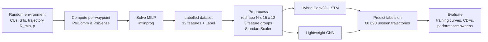

# Learning MILP-Optimal Sensing & Communication Scheduling for an ISAC UAV

> A UAV flies a 15-waypoint path and, at every waypoint, must choose to **sense** ground targets,
> **communicate** with ground users, or do **both**. A Mixed-Integer Linear Program (MILP) finds the
> optimal schedule. Deep networks (a **Hybrid Conv3D-LSTM** and a **lightweight CNN**) are trained to
> imitate the MILP, so a near-optimal schedule comes from a single forward pass instead of an optimisation solve.


---

## Table of Contents
- [Problem](#problem)
- [Pipeline](#pipeline)
- [System Model](#system-model)
- [MILP Formulation](#milp-formulation)
- [Dataset](#dataset)
- [Models](#models)
- [Results](#results)
- [Repository Structure](#repository-structure)
- [How to Run](#how-to-run)
- [Limitations & Future Work](#limitations--future-work)
- [Documentation](#documentation)

---

## Problem

| Label | Mode | Contributes to |
|:---:|---|---|
| **1** | Sensing only | target localisation |
| **2** | Communication only | user data rate |
| **3** | Joint ISAC (sense + communicate) | both |

**Goal:** maximise sensing accuracy (minimise the localisation Cramér-Rao Bound) while
guaranteeing that the users receive at least `R_min` bits over the flight, with communication
prioritised early in the flight.

**Why ML?** Solving a MILP for every new environment is slow (solver capped at 60 s). A trained
network gives the schedule instantly, which suits real-time and onboard use.

---

## Pipeline



---

## System Model

| Parameter | Value |
|---|---|
| Area | 500 m x 300 m, UAV from (0,0) to (500,300) |
| Altitude / hover time | 70 m / 10 s per waypoint |
| Waypoints | 15 (random trajectory, ~60 m steps) |
| Communication users (CUs) / Sensing targets (STs) | 10 / 10, uniformly random |
| Transmit power, bandwidth | 0.1 W, 10 MHz (equal split over CUs) |
| Wavelength, noise power | 0.1 m, 1e-9 W |

**Communication metric `PsiComm`:** mean bits delivered to a CU at a waypoint,
`T_h · (B/M) · log2(1 + Pt·α0 / (d²·σ²))`. Higher is better.

**Sensing metric `PsiSense`:** mean over targets of the **Cramér-Rao Bound**
`trace(FIM⁻¹)` for 2-D target localisation. The FIM accumulates range measurements, each with
variance ∝ d⁴ (two-way radar path loss). Lower is better. With a single look the FIM is singular,
so the bound is stored as `1e18`.

---

## MILP Formulation

Binary variables `x_j1, x_j2, x_j3` for each waypoint j (45 binaries):

```
minimise   Σ_j [ −fs_j·x_j1 + η·x_j2 + (−fs_j + η)·x_j3 ]      fs_j = 1/PsiSense_j,  η = 1e-4
subject to x_j1 + x_j2 + x_j3 = 1                               (one mode per waypoint)
           Σ_j PsiComm_j·(x_j2 + x_j3) ≥ R_min                  (communication requirement)
           x_j1 = x_j3 = 0  while cumulative comm < p·R_min     (communicate-first rule)
```

The typical optimal schedule is **communicate → joint → sense-only**. Every trajectory
starts in mode 2, and mode 2 disappears after about waypoint 10.

---

## Dataset

| File | Trajectories | Rows | Columns | Role |
|---|---:|---:|---|---|
| `data/Copy of UAV90BIG1.xlsx` | 6,000 | 90,000 | 12 features + Label | training |
| `master_table_FULLdec.xlsx`* | 60,690 | 910,350 | 12 features + 40 CU/ST coordinates + Label | testing & graphs |
| `full_dec_cnn.xlsx`* | 60,690 | 910,350 | 12 features + Label + Predicted_Label | CNN predictions |

\* Over GitHub's 100 MB file limit, so kept locally and excluded from the repo.

**Features (per waypoint):** `X, Y, MeanDistCU, MinDistCU, MaxDistCU, MeanDistST, MinDistST,
MaxDistST, PsiComm, PsiSense, Rmin, FractionP` → `Label ∈ {1,2,3}`

**Class balance:** Sensing 62.5% · Communication 22.6% · Joint 15.0%

---

## Models

Both models take one trajectory `(15 x 12)` and output a 3-class softmax **for every waypoint**
(many-to-many sequence labelling). The features are split into 3 groups, and each group goes
through its own branch before the branches are merged.

| | **Hybrid Conv3D-LSTM** | **Lightweight CNN** (baseline) |
|---|---|---|
| Branch | Conv3D(3x1x3) → BN → Conv3D(1x1x3) → BN → Dense 128 → **LSTM 128** → Dense 64 | GaussianNoise → Conv2D(3x1) → Dense 16 |
| Head | Dense 128 → BN → Dense 3 → softmax | Dense 32 → Dense 3 → temperature softmax (T=1.3) |
| Temporal context | full sequence (LSTM memory) | ±1 waypoint only |
| Regularisation | Dropout 0.5, BatchNorm | Dropout 0.6, Gaussian noise, grad-clip 0.3 |
| Imbalance handling | none | output bias = 1.5·log(class priors) |
| Optimiser | Adam 3e-4, batch 16, 500 epochs | Adam 3e-5, batch 32, 500 epochs |

---

## Results

| Metric | Hybrid CNN-LSTM | CNN |
|---|:---:|:---:|
| Final training accuracy | **~96.7%** | ~81% |
| Test per-waypoint accuracy (60,690 trajectories) | n/a† | 86.5% |
| Test recall: Sensing / Comm / Joint | n/a† | 93.8% / 95.9% / 41.3% |
| Test trajectories meeting `R_min` (MILP = 100%) | n/a† | 40.2% |

† The Hybrid prediction file is not included in this repository.

Figures (see [`results/`](results/results_figures_milp_vs_hybrid_vs_cnn.pdf)):
- **Loss / accuracy vs epoch** for both models
- **CDF of aggregate sensing & communication performance**: MILP vs Hybrid, where the curves closely overlap
- **Sensing vs number of STs / communication vs number of CUs** sweeps

**Takeaway:** sequence memory matters. The CNN, without an LSTM, mostly confuses *joint* with
*sensing-only*. Telling these apart requires knowing how much data has already been delivered
along the trajectory.

---

## Repository Structure

```
├── 01_dataset_generation/
│   └── generate_dataset_milp.m                  # random envs → PsiComm/PsiSense → MILP labels
├── 02_data_checks/
│   ├── check_dataset_files_and_shapes.py
│   └── check_prediction_file_columns.py
├── 03_models/
│   ├── hybrid_cnn_lstm/
│   │   ├── train_hybrid_cnn_lstm.py
│   │   └── predict_hybrid_cnn_lstm.py
│   └── cnn/
│       ├── train_cnn.py
│       └── predict_cnn.py
├── 04_evaluation_graphs/
│   ├── training_curves/   plot_loss_vs_epoch.py, plot_accuracy_vs_epoch.py
│   ├── cdf_plots/         cdf_sensing_milp_vs_hybrid.py, cdf_sensing_milp_vs_cnn.py,
│   │                      cdf_communication_milp_vs_hybrid.py
│   └── sweep_plots/       sweep_sensing_vs_num_st_hybrid.py, sweep_communication_vs_num_cu_hybrid.py,
│                          sweep_sensing_and_communication_cnn.py
├── data/                  # training set (test sets kept locally)
├── results/               # compiled result figures (PDF)
└── docs/PROJECT_EXPLANATION.md
```

---

## How to Run

**Requirements:** MATLAB with the Optimization Toolbox; Python with `tensorflow`, `numpy`,
`pandas`, `scikit-learn`, `matplotlib`, `numba`, `openpyxl`.

```bash
pip install tensorflow numpy pandas scikit-learn matplotlib numba openpyxl
```

1. **Generate data:** run `01_dataset_generation/generate_dataset_milp.m` in MATLAB. It needs the helper
   `UAV_random_trajectory.m`, which is not included.
2. **Train:** `python 03_models/hybrid_cnn_lstm/train_hybrid_cnn_lstm.py` (or `03_models/cnn/train_cnn.py`).
   This writes a `.h5` model and `training_log.csv`.
3. **Predict:** `predict_hybrid_cnn_lstm.py` / `predict_cnn.py` add a `Predicted_Label` column to the test set.
4. **Plot:** run the scripts in `04_evaluation_graphs/`.

> **Path note:** the scripts use hard-coded relative paths. Train/predict, data-check and CDF
> scripts read from `<parent of script folder>/Dataset/`. Sweep scripts read from their own
> folder. Training-curve scripts read `training_log.csv` from the working directory. Place the
> files accordingly.

---

## Limitations & Future Work
- Only training curves are logged. A validation split with early stopping would strengthen the evaluation.
- The prediction scripts re-fit `StandardScaler` on test data. Reusing the training scalers is standard practice.
- The `1e18` singular-CRB value dominates `PsiSense` after scaling. A log transform would keep the information.
- The learned schedules can violate `R_min`. Constraint-aware training or a feasibility-repair step is the natural next step.
- The sweep plots count the first K sensing/communication waypoints. They do not re-simulate with K targets or users.

---

## Documentation
A full walkthrough covering every stage, input/output shapes, graph interpretation and
Q&A is in [docs/PROJECT_EXPLANATION.md](docs/PROJECT_EXPLANATION.md).

<details>
<summary>File rename map (original → current)</summary>

| Original | Current |
|---|---|
| Codes/Optcode/MatlabOptimazation.txt | 01_dataset_generation/generate_dataset_milp.m |
| Codes/PythonCodes/ds_check.py | 02_data_checks/check_dataset_files_and_shapes.py |
| Codes/PythonCodes/check_cols.py | 02_data_checks/check_prediction_file_columns.py |
| Codes/PythonCodes/model.py | 03_models/hybrid_cnn_lstm/train_hybrid_cnn_lstm.py |
| Codes/PythonCodes/test_hyb.py | 03_models/hybrid_cnn_lstm/predict_hybrid_cnn_lstm.py |
| Codes/PythonCodes/cnn_model.py | 03_models/cnn/train_cnn.py |
| Codes/PythonCodes/test_cnn.py | 03_models/cnn/predict_cnn.py |
| Codes/PythonCodes/a_vs_e.py | 04_evaluation_graphs/training_curves/plot_accuracy_vs_epoch.py |
| Codes/PythonCodes/l_vs_e.py | 04_evaluation_graphs/training_curves/plot_loss_vs_epoch.py |
| Codes/PythonCodes/sense_calc_hyb_graph.py | 04_evaluation_graphs/cdf_plots/cdf_sensing_milp_vs_hybrid.py |
| Codes/PythonCodes/sense_calc_cnn.py | 04_evaluation_graphs/cdf_plots/cdf_sensing_milp_vs_cnn.py |
| Codes/PythonCodes/comm_calc_hyb_graph.py | 04_evaluation_graphs/cdf_plots/cdf_communication_milp_vs_hybrid.py |
| Codes/PythonCodes/Sensing_vs_ST's_graph.py | 04_evaluation_graphs/sweep_plots/sweep_sensing_vs_num_st_hybrid.py |
| Codes/PythonCodes/Communication_vs_CU's_graph.py | 04_evaluation_graphs/sweep_plots/sweep_communication_vs_num_cu_hybrid.py |
| Codes/PythonCodes/Comm_vs_CU's_graph_cnn.py | 04_evaluation_graphs/sweep_plots/sweep_sensing_and_communication_cnn.py |
| result/Result.pdf | results/results_figures_milp_vs_hybrid_vs_cnn.pdf |

</details>
